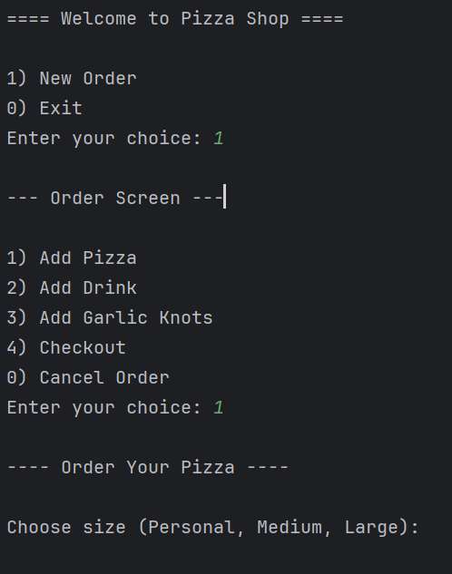
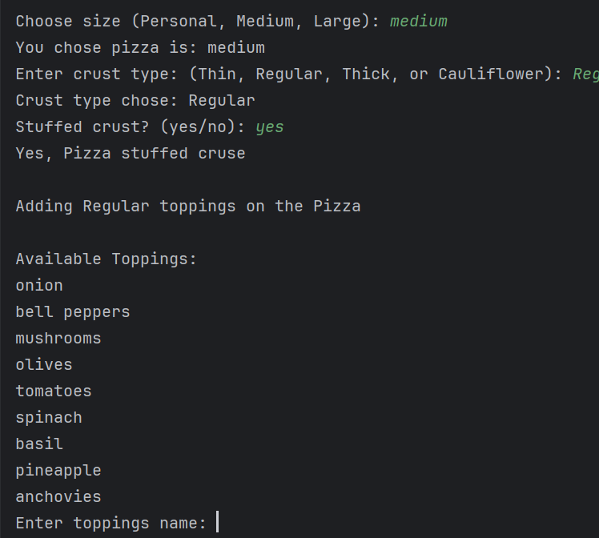
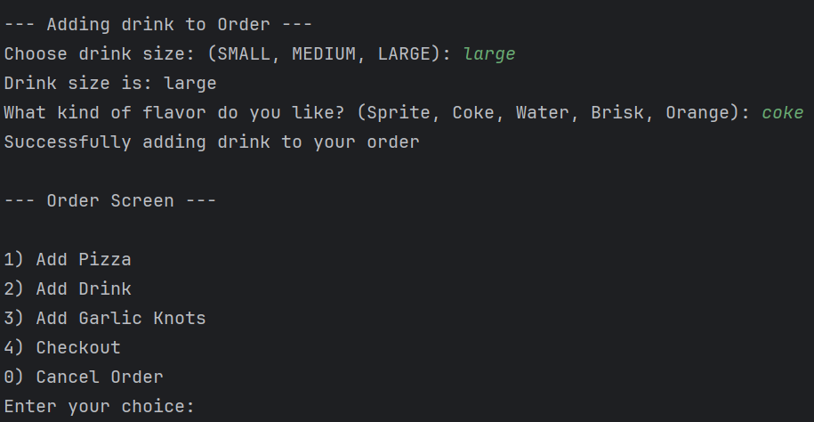

# Project Title: Pizza Shop
## Description of the Project

This project is a Java console-based application that simulates a real-world pizza ordering system. Users can create customized pizza orders by selecting pizza size, crust type, and various toppings, including regular and premium options. The system also allows the addition of drinks and garlic knots. It calculates the total cost and generates a receipt, which is saved to a file.
## User Stories

- As a user, I want to see menu options, so I can view my orders and choose what I can take
- As a user, I want to buy a pizza, and I want a customized it and choose a different size, type, and toppings so that I can create my own pizza before making an order
- As a user, I want to add garlic nots to the side item to my order so that I can calculate my total order with garlic nots
- As a user, I want to add different types of toppings to the pizza so that I can customize my pizza to what I like
- As a user, I want to add different sizes of drinks with flavors to my order, so that I can enjoy my meals with a beverage
- As a user, I want to interact with a simple on-screen menu so that I can create , view and complete my order

## Setup

Instructions on how to set up and run the project using IntelliJ IDEA.

### Prerequisites

- IntelliJ IDEA: Ensure you have IntelliJ IDEA installed, which you can download from [here](https://www.jetbrains.com/idea/download/).
- Java SDK: Make sure Java SDK is installed and configured in IntelliJ.

### Running the Application in IntelliJ

Follow these steps to get your application running within IntelliJ IDEA:

1. Open IntelliJ IDEA.
2. Select "Open" and navigate to the directory where you cloned or downloaded the project.
3. After the project opens, wait for IntelliJ to index the files and set up the project.
4. Find the main class with the `public static void main(String[] args)` method.
5. Right-click on the file and select 'Run 'YourMainClassName.main()'' to start the application.

## Technologies Used

- Java: Java: openjdk 17.0.12 2024-07-16. 
- Tools: IntelliJ IDEA.

## Demo

## Class Diagram

## Future Work

Add Pizza, Drinks, GarlicKnots
- Customer are allowed to customize pizza

Adding topping to Pizza

- Customer allowed to choose different topping 
- If customer choose extra topping, it will be additional charge
- Premium topping: Meats and Cheese 

## Resources

List resources such as tutorials, articles, or documentation that helped you during the project.
- https://chatgpt.com/g/g-681d378b0c90819197b16e49abe384ec-potato-sensei
- Capstone 1 information
- Multiple exercise

## Team Members
- Mohammad Hussain

## Thanks
- Thank you to [Raymond] for continuous support and guidance.
- A special thanks to all teammates for their dedication and teamwork.
- Nauman Saqib, Arsenni Kunilovski, Andy Wu

